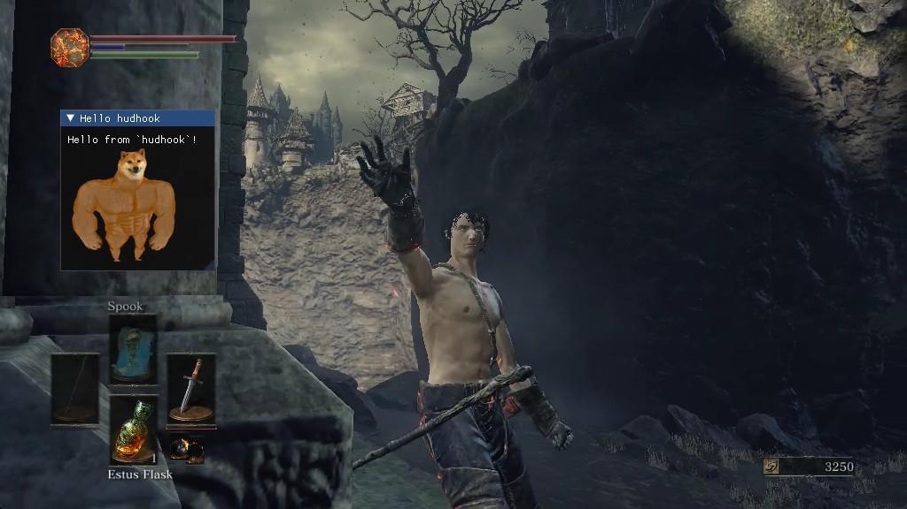

# hudhook


[](https://github.com/veeenu/hudhook/releases)
[](https://crates.io/crates/hudhook)
[](https://github.com/veeenu/hudhook/blob/main/LICENSE)
[](https://discord.gg/CVHbN7eF)
[](https://veeenu.github.io/hudhook)
[](https://veeenu.github.io/hudhook/rustdoc/hudhook)
[](https://www.patreon.com/johndisandonato)

A Rust renderer hook library for building [Dear ImGui](https://github.com/ocornut/imgui) overlays.

Currently supports DirectX 9, DirectX 11, DirectX 12 and OpenGL 3. Runs on Windows and Wine/Proton.



## Resources

- [Tutorial book](https://veeenu.github.io/hudhook).
- [API reference](https://veeenu.github.io/hudhook/rustdoc/hudhook).
- [Architecture blog post](https://veeenu.github.io/blog/sekiro-practice-tool-architecture/) (a bit outdated).

## Supporting the project

If you like `hudhook` and would like to support the project, you can do so via my [Patreon](https://www.patreon.com/johndisandonato).

I'm glad the project works for you and I'm grateful for your support. Thank you!

## Example

```rust
// src/lib.rs
use hudhook::*;

pub struct MyRenderLoop;

impl ImguiRenderLoop for MyRenderLoop {
    fn render(&mut self, ui: &mut imgui::Ui) {
        ui.window("My first render loop")
            .position([0., 0.], imgui::Condition::FirstUseEver)
            .size([320., 200.], imgui::Condition::FirstUseEver)
            .build(|| {
                ui.text("Hello, hello!");
            });
    }
}

{
    // Use this if hooking into a DirectX 9 application.
    use hudhook::hooks::dx9::ImguiDx9Hooks;
    hudhook!(ImguiDx9Hooks, MyRenderLoop);
}

{
    // Use this if hooking into a DirectX 11 application.
    use hudhook::hooks::dx11::ImguiDx11Hooks;
    hudhook!(ImguiDx11Hooks, MyRenderLoop);
}

{
    // Use this if hooking into a DirectX 12 application.
    use hudhook::hooks::dx12::ImguiDx12Hooks;
    hudhook!(ImguiDx12Hooks, MyRenderLoop);
}

{
    // Use this if hooking into an OpenGL 3 application.
    use hudhook::hooks::opengl3::ImguiOpenGl3Hooks;
    hudhook!(ImguiOpenGl3Hooks, MyRenderLoop);
}
```

```rust
// src/main.rs
use hudhook::inject::Process;

fn main() {
    let mut cur_exe = std::env::current_exe().unwrap();
    cur_exe.push("..");
    cur_exe.push("libmyhook.dll");

    let cur_dll = cur_exe.canonicalize().unwrap();

    Process::by_name("MyTargetApplication.exe").unwrap().inject(cur_dll).unwrap();
}
```
